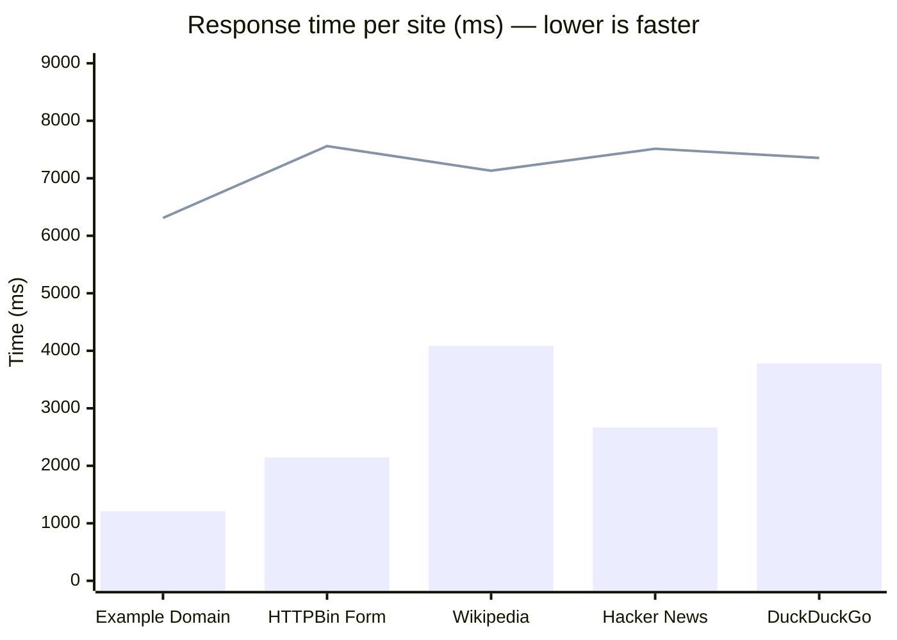

<div align="center">

# Agent Browser

**A browser built for AI agents, not humans.**

[](https://railway.app/new/template?template=https://github.com/Abhishekxdg/Agentic-browser)
&nbsp;
[](LICENSE)

</div>

---

Traditional browser automation breaks every time a UI changes. Your agent spends half its time debugging CSS selectors instead of doing useful work.

Agent Browser takes a different approach: instead of exposing raw DOM to your agent, it converts every page into **structured JSON** your LLM can read natively — forms, fields, buttons, tables, links, all labeled by what they *mean*, not where they *are*.

Your agent says `"fill the login form email field"`. The browser figures out which input that is. If the site redesigns tomorrow, the same instruction still works.

```
Agent says:                          Browser does:
──────────────────────────────────   ────────────────────────────────────
{"type":"fill",                  →   Finds input where name/label/
  "form":"login",                    placeholder matches "email",
  "field":"email",                   sets value, fires change event
  "value":"me@example.com"}

{"type":"click","target":"Submit"} → Finds button/link with that label,
                                     clicks it, waits for navigation

{"type":"wait",                  →   Waits for network to go quiet
  "condition":"network.idle"}
```

---

## How it works

```
┌─────────────────────────────────────────────────────────────────────┐
│  Your AI Agent  (Python / TypeScript / any language)                │
│                                                                     │
│  page = navigate("https://app.example.com")                         │
│  # page = {forms:[{id:"login",fields:[{name:"email",...},...]},...]} │
│                                                                     │
│  action({"type":"fill","form":"login","field":"email","value":"x"}) │
│  action({"type":"click","target":"Sign in"})                         │
└────────────────────┬────────────────────────────────────────────────┘
                     │  HTTP REST  /  WebSocket
                     ▼
┌─────────────────────────────────────────────────────────────────────┐
│  Agent Browser Server  (runs locally or on any server)              │
│                                                                     │
│  ┌─────────────────┐    ┌──────────────────┐    ┌───────────────┐  │
│  │  Semantic Page  │    │  Action Resolver  │    │  CDP Bridge   │  │
│  │                 │    │                   │    │               │  │
│  │  DOM → JSON     │    │  "click Submit"   │    │  Chrome ←→    │  │
│  │  forms, fields  │    │  → find element   │    │  WebSocket    │  │
│  │  buttons, links │    │  → cdp click      │    │  (CDP)        │  │
│  │  tables, content│    │  → auto-fallback  │    │               │  │
│  └─────────────────┘    └──────────────────┘    └───────────────┘  │
│                                                                     │
│  One Chrome process per session. Sessions persist until closed.     │
└─────────────────────────────────────────────────────────────────────┘
```

**The page model** is what makes this different. Every `navigate` call returns JSON like this:

```json
{
  "page": { "url": "https://mail.zoho.in", "title": "Zoho Mail" },
  "forms": [{
    "id": "login",
    "purpose": "authentication",
    "fields": [
      { "name": "LOGIN_ID", "type": "text",     "label": "Email Address" },
      { "name": "PASSWORD", "type": "password", "label": "Password"      }
    ],
    "actions": [{ "name": "nextbtn", "label": "Next", "action": "login" }]
  }],
  "interactive": [
    { "id": "btn-compose", "type": "button", "label": "New Mail" }
  ],
  "tables": [...],
  "navigation": [...],
  "dialogs": [...]
}
```

Your agent reads this, decides what to do, calls `action()`. No vision model. No selector guessing. No screenshots.

---

## Current evals

Local eval run after the fast semantic extraction and parallel-session fixes:

```bash
bun test
# 42 pass, 0 fail

bun run eval
# 11/12 sites passed (92%)
# Total time: 21.7s

bun run evals/feasibility-gate.ts
# 4/5 sites passed (80%)
# Total time: 14.3s

bun run evals/playwright-comparison-benchmark.ts
# playwright:    5/5 passed, avg 4501ms
# agent-browser: 5/5 passed, avg 6459ms
# Total wall time: 7.6s
```

The Playwright comparison is a raw page-check benchmark. Playwright is still faster at low-level browser automation; Agent Browser adds a semantic page model and intent-style actions so AI agents spend less time reasoning about selectors and DOM shape.

---

## Quick Start

### Option 1 — One-click deploy on Railway

[](https://railway.app/new/template?template=https://github.com/Abhishekxdg/Agentic-browser)

Deploys the server to a public HTTPS URL in ~2 minutes. Set `AGENT_BROWSER_API_KEY` in the Railway dashboard before deploying.

### Option 2 — Docker (local, no Bun required)

```bash
git clone https://github.com/Abhishekxdg/Agentic-browser
cd agent-browser
docker compose up
# Server at http://localhost:3001
```

### Option 3 — Local with Bun

```bash
git clone https://github.com/Abhishekxdg/Agentic-browser
cd agent-browser
bun install
bunx playwright install chromium
bun run start
# Server at http://localhost:3001
```

---

## Use with Claude (MCP)

The fastest way to use Agent Browser — no SDK, no HTTP calls. Claude controls the browser directly as a tool.

**Claude Desktop** — add to `~/.claude/claude_desktop_config.json`:
```json
{
  "mcpServers": {
    "agent-browser": {
      "command": "bun",
      "args": ["run", "/path/to/agent-browser/src/mcp/server.ts"]
    }
  }
}
```

**Claude Code**:
```bash
claude mcp add agent-browser -- bun run /path/to/agent-browser/src/mcp/server.ts
```

Then just talk to Claude:
> *"Go to zoho mail, log in with my 'zoho' saved profile, and send an email to..."*
> *"Open github.com/notifications and summarize my unread notifications"*
> *"Log into our invoice portal and find all invoices over $5k that are past due"*

[Full MCP setup guide →](docs/mcp-setup.md)

---

## Use with Python

```bash
pip install "git+https://github.com/Abhishekxdg/Agentic-browser.git#subdirectory=sdk/python"
```

```python
from agentbrowser import AgentBrowser

agent = AgentBrowser()  # points to localhost:3001 by default

with agent.session() as sid:
    # Navigate — get page structure as JSON
    page = agent.navigate(sid, "https://mail.zoho.in")

    # Read what's on the page
    print(page["page"]["title"])     # "Zoho Mail"
    print(page["forms"])             # [{id:"login", fields:[...]}]

    # Act on it
    agent.action(sid, {"type": "fill", "form": "login", "field": "LOGIN_ID", "value": "me@x.com"})
    agent.action(sid, {"type": "press", "key": "Enter"})
    agent.action(sid, {"type": "wait", "condition": "network.idle"})

    # Save login session — never log in again
    agent.action(sid, "POST", f"/session/{sid}/auth/save", {"profile": "zoho"})

    # Run JS for anything semantic actions can't reach
    result = agent.js(sid, "document.querySelectorAll('.unread').length")

    # Screenshot
    agent.screenshot(sid, path="/tmp/inbox.png")
```

---

## Use with any LLM agent

Agent Browser is LLM-agnostic. The pattern is the same everywhere:

1. Call `navigate(url)` → get the page model
2. Feed the page model to your LLM as context
3. LLM calls `action(...)` to interact
4. Repeat

Works with OpenAI function calling, Gemini tool use, Claude tool use, LangChain tools, CrewAI, AutoGen — anything that can make an HTTP request.

See [`examples/gemini-agent.ts`](examples/gemini-agent.ts) for a complete working example: a Gemini 3.5 Flash agent that logs into Zoho Mail and sends an email, fully autonomously, using only this API.

---

## Session persistence & auth

Sessions stay open between calls — Chrome keeps the page loaded, cookies intact, login state preserved. Pause for user input, wait an hour, come back: the browser is still there.

**Save a login session** so you never log in again:
```bash
# After logging in manually once:
curl -X POST http://localhost:3001/session/$SID/auth/save \
  -H "Authorization: Bearer dev-key" \
  -d '{"profile": "zoho-mail"}'

# Restore in any future session:
curl -X POST http://localhost:3001/session/$SID/auth/load \
  -d '{"profile": "zoho-mail"}'
```

Cookies saved to `~/.agent-browser/cookies/<profile>.json`.

---

## Action fallback

When a semantic action can't find an element, it automatically escalates:

```
click("Submit")
  → 1. semantic page model lookup
  → 2. visible text search
  → 3. CSS selector (if hint looks like one)
  → 4. partial text match across all interactive elements
```

Your agent rarely needs to worry about "element not found".

---

## API at a glance

| Method | Path | Description |
|--------|------|-------------|
| `POST` | `/session` | Create session → `session_id` |
| `DELETE` | `/session/:id` | Close session |
| `POST` | `/session/:id/navigate` | Navigate to URL → page model |
| `GET` | `/session/:id/page` | Current page model |
| `POST` | `/session/:id/action` | Execute one action |
| `POST` | `/session/:id/actions` | Execute sequence |
| `POST` | `/session/:id/evaluate` | Run JavaScript |
| `GET` | `/session/:id/screenshot` | PNG screenshot |
| `POST` | `/session/:id/auth/save` | Save cookies to profile |
| `POST` | `/session/:id/auth/load` | Restore cookies from profile |
| `WS` | `/session/:id/stream` | Real-time page mutations |

[Full API reference →](docs/api-reference.md)

---

## Environment variables

| Variable | Default | Description |
|----------|---------|-------------|
| `AGENT_BROWSER_API_KEY` | `dev-key` | Auth key — change this in production |
| `AGENT_BROWSER_PORT` | `3001` | Server port |
| `CHROMIUM_PATH` | auto-detected | Override Chromium binary path |
| `HEADLESS` | `true` | Set `false` to watch the browser |
| `CHROME_FLAGS` | — | Extra Chrome flags (e.g. `--no-sandbox` for cloud) |

---

## Documentation

| | |
|---|---|
| [Getting Started](docs/getting-started.md) | Install, first session, first action |
| [How the Page Model Works](docs/page-model.md) | The JSON structure your agent reads |
| [All Action Types](docs/action-types.md) | 30+ actions with examples |
| [API Reference](docs/api-reference.md) | Every endpoint documented |
| [Python SDK](docs/python-sdk.md) | SDK methods reference |
| [MCP Setup](docs/mcp-setup.md) | Use in Claude Desktop / Claude Code |
| [Examples](docs/examples.md) | Login, scrape, send email, multi-tab, LLM loop |
| [Troubleshooting](docs/troubleshooting.md) | Common errors and fixes |
| [Roadmap](ROADMAP.md) | What's next — 8 phases from reliability to semantic OS |

---

## Benchmark — Agent Browser vs Playwright

Measured on 5 real sites, both tools running in parallel. Same success rate (4/5). Agent Browser is slower per call but provides semantic abstractions Playwright cannot.



> **Bar = Playwright · Line = Agent Browser**

| Site | Playwright | Agent Browser | Winner |
|------|-----------|--------------|--------|
| Example Domain | ✅ 1209ms | ✅ 6310ms | PW (raw speed) |
| HTTPBin Form | ❌ 2147ms | ❌ 7560ms | Tie (both failed) |
| Wikipedia | ✅ 4088ms | ✅ 7131ms | PW (raw speed) |
| Hacker News | ✅ 2665ms | ✅ 7514ms | PW (raw speed) |
| DuckDuckGo | ✅ 3778ms | ✅ 7353ms | PW (raw speed) |
| **Total** | **4/5 · avg 2777ms** | **4/5 · avg 7174ms** | Same pass rate |

**Why Agent Browser is slower:** every call runs semantic page extraction (DOM → structured JSON) on top of navigation. The 4-5s overhead is the extraction pipeline.

**What Playwright can't do:**

| Capability | Playwright | Agent Browser |
|-----------|-----------|--------------|
| Semantic form fill (`fill("login", "email", "x@y.com")`) | ❌ needs CSS selector | ✅ |
| Auto-login (detects + fills login forms) | ❌ manual | ✅ |
| CAPTCHA solving | ❌ | ✅ |
| LLM agent loop (`run(sid, "book a flight")`) | ❌ | ✅ |
| API replay (record once, replay via HTTP) | ❌ | ✅ |
| Human-in-the-loop pause/resume | ❌ | ✅ |
| MCP tool (use in Claude Desktop) | ❌ | ✅ |
| Intent → action without selectors | ❌ | ✅ |


---

> **License:** Personal & educational use only. Derivatives must be open source under the same license. Commercial use requires written permission — [contact us](mailto:myuvarajgowda@gmail.com). See [LICENSE](LICENSE).
